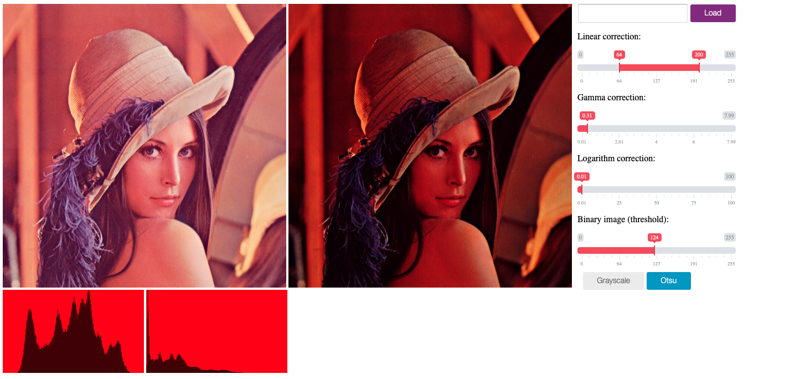

# dip-playground



Experiments with digital image processing (linear, gamma, logarithmic correction, thresholding, grayscale).

## Run

To start application (on 8000 port) use:

```shell
python -m SimpleHTTPServer
```
